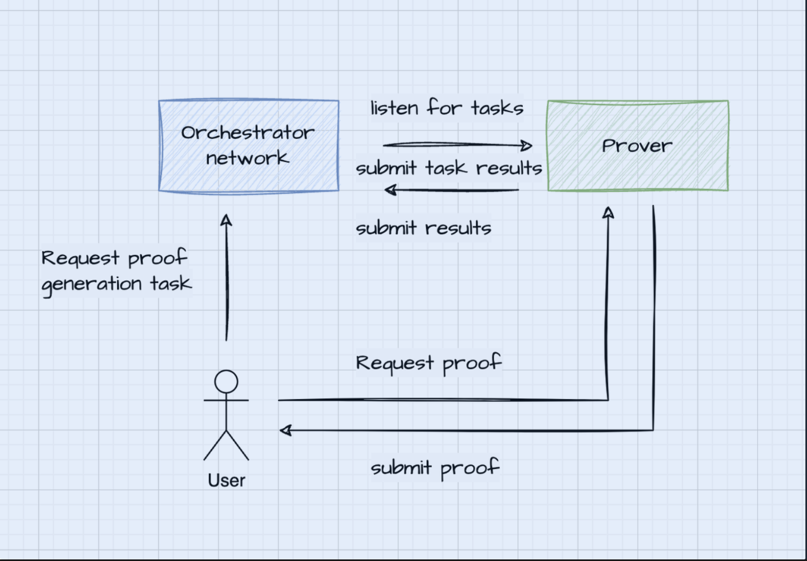

# ProofPlus - Decentralized Prover Protocol

## What is ProofPlus?
ProofPlus is a permissionless, decentralized prover market protocol that utilizes a ticketing mechanism to democratize proof generation tasks.

ProofPlus aims to revolutionize the zero-knowledge proof (ZKP) landscape by enabling both enterprise-grade and small-scale provers to participate and earn revenue. The protocol ensures inclusivity and fairness through its innovative ticketing system, which balances the playing field based on self-reported proof generation capabilities.

**Permissionless:** ProofPlus allows everyone to participate in the proof market, providing equal opportunities for all participants to earn revenue, regardless of their scale.

**Community-aligned:** ProofPlus is built with the support of its community and is fully open-source. This means anyone can use, modify, and contribute to the ProofPlus source code under a permissive license. The project encourages community engagement in reviewing, auditing, testing, and improving the protocol, fostering a collaborative and transparent ecosystem.

## Introduction

Zero-knowledge technology significantly enhances blockchain by providing privacy, scalability, and efficiency. It allows transactions to be verified without revealing sensitive information, ensuring user confidentiality while maintaining trust. This is particularly valuable in financial and identity-related applications, where privacy is crucial. Additionally, zero-knowledge proofs can improve scalability by reducing the amount of data processed on-chain, leading to lower operating costs. By enabling secure and private interactions, zero-knowledge technology fosters greater adoption of blockchain across various sectors, promoting a more secure and efficient decentralized ecosystem.

Groth16 proofs, known for their succinctness, allow complex computations to be verified with minimal calldata, reducing on-chain processing and transaction costs. Compared to executing the same logic in the Ethereum Virtual Machine (EVM), these proofs offer a more cost-effective solution in terms of on-chain gas. Currently, a Groth16 proof verification on-chain costs about a constant ~280k gas without regard to the size and complexity of the underlying logic that is being proven.

## Current State of zkVMs

Recently, user-friendly zero-knowledge virtual machines (zkVMs) like SP1 and Risc Zero have emerged, streamlining the integration of zero-knowledge proofs into various platforms. These zkVMs simplify the development process, enabling developers to leverage advanced cryptography without extensive expertise, thus broadening the adoption of secure, privacy-preserving technologies across industries.

## Challenges zkVM projects are facing

Zero-knowledge virtual machines (zkVMs) face challenges, particularly with the slow generation of Groth16 proofs. While these proofs are efficient for verification, their creation can be computationally intensive. For instance, generating a proof to validate a single BLS signature can take over eight hours on a high-end GPU virtual machine. An in-depth report of the benchmarks and findings for local and remote proof generation using Risc Zero can be found [here](https://www.notion.so/Hedera-State-Consensus-ZK-PoC-Findings-f86d92f22f684f3c8ba26dd182eaf122?pvs=21).

In addition to proof generation time, current zkVM provers face centralization challenges. Relying on a single entity to provide valid proofs is suboptimal, as it introduces the risk of censorship and control over request processing. Decentralizing the proof generation process is crucial to ensuring transparency and resilience, allowing for a more secure and trustworthy blockchain ecosystem where no single point of failure or control exists.

## An On-chain proof market

We can reuse the economic security of Ethereum L1 to ensure it is very economically unfeasible to produce a malicious proof generation response ( > 2/3 of validators need to agree on the message). Furthermore, we will enforce a reorg protection period of X blocks in order to ensure “finality”.

Proof generation requests are to be made on-chain, passing metadata, containing the hash of the ELF binary to be run, the public inputs hash, and the private inputs hash.

## Terminology

The following is a list of terms and their corresponding definitions:

**Zero-Knowledge Proof (ZKP)**: A cryptographic method that allows one party to prove the validity of a statement without revealing any underlying information. This ensures privacy and security in digital transactions by confirming facts without exposing sensitive data.

**RISC-V ELF Binary (Binary)**: An executable file format for programs compiled on the RISC-V architecture, using the Executable and Linkable Format (ELF). It contains machine code and metadata, enabling programs to run on RISC-V processors.

## Actors

**User SDK** - requests proof generation tasks

**Prover SDK** - Generates on-demand ZKPs. A sophisticated entity tasked with fast proof generation. It may use hardware acceleration such as FPGAs, enterprise-grade GPUs, or ASICs.

**Orchestrator network** - orchestrates proof generation tasks and resolves conflicts in case of malicious behavior.

## Flow

- User requests proof generation task from the On-chain protocol through an SDK
- User listens for a specific event from the Orchestrator network, fetching the server URL of the assigned prover
- User requests ZKP from prover
- Prover generates ZKP and in parallel:
  - submits task result to the Orchestrator network
  - returns the ZKP back to the User
- User listens for an event from the Orchestrator network for the task completion, validates its received proof and data against those on-chain.
  - In case of mismatch or liveness fault, triggers a slashing method.



## Orchestrator Network

The Orchestrator network - an on-chain protocol - is responsible for conflict resolution and orchestration of proof requests.

It will delegate proof generation request tasks, binding a task to a prover. Instead of relying on the reputation of the prover, it will rank provers based on objective metrics, such as proof generation success rate (liveness) and proof generation time.

In order for provers to participate in the protocol, they will need to register by depositing pre-defined collateral, serving as stake, and report their capabilities and public endpoint. Based on the self-reported proof generation time, the protocol will expect given tasks to be completed on time; otherwise, the prover will be subject to slashing conditions.

### DTO

The Orchestrator Network keeps track of task structs with the following structure:

```bash
    struct TaskStatus {
        address requester;
        address prover;
        uint256 reward;
        bytes32 imageId;
        bytes32 publicInputsHash;
        bytes32 proofHash;
    }
```
`publicInputsHash` and `proofHash` are reported by the Prover SDK on proof task submission and the taskId is internally generated by the protocol contracts.
## Prover SDK
A lightweight SDK module is implemented to aid the prover - ProverServer -  that exposes a POST endpoint `/proof`, allowing the User to pass all constituents necessary for proof generation - the ELF binary and the private inputs. It must have an on-chain listener that fetches the proof generation request metadata and verifies correctness of the downloaded binary and inputs against the hashes. It then starts the proof generation process locally. Upon successful proof generation, it must return the proof back to the requester off-chain. It must also submit a task submission response to the on-chain protocol with the `taskId , proofHash and binaryHash`.

## User - client SDK

a lightweight SDK module is implemented for the User - `ProofPlusClient` - that:

- Initiates an on-chain request to the Orchestator network.
- listens for an event containing the `endpoint` of the server of the Prover tasked with the proof generation
- long-polls the prover for the ZKP response at the fetched `endpoint`
- verifies its received proof against the `proofHash` , as the Prover is also required to submit the task completion transaction to the Orchestration network

## Slashing

The User SDK also serves as a Slasher. In case of mismatch of the locally computed proof hash and the one on-chain, or in case of , the User SDK calls the `slash` method, passing the whole proof, it’s local public inputs, the `taskId`, and the whole binary. If the proof with the public inputs (passed as calldata) verifies correctly on-chain and the binary, when hashed, don’t correspond to the `publicInputsHash` , then the Prover was mallicious and gets slashed.

## Roadmap

- Add SP1 support
- Add ProofPlus token EIP-712 Permits
